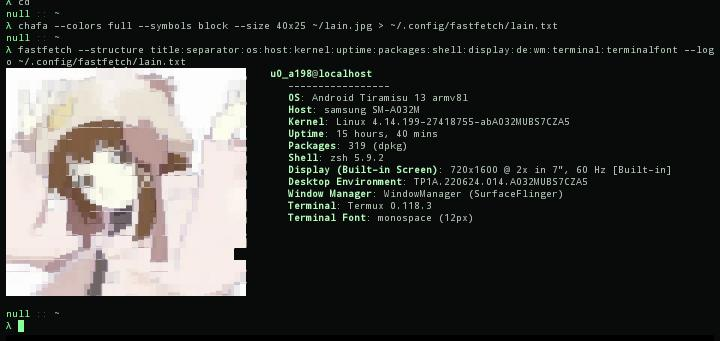

# termux-lain-style

with a single script,you can customize Neovim,your colors scheme,fonts,fastfetch,and more.

## why 
a good-looking doesn't have to be resource-intensive 


## requirements
 - git
 - fastfetch
 - neovim 
 - zsh must be set as your default shell 

 ## Usage 
1- cloning the repository
 ```bash
 git clone https://github.com/nullzinx/termux-lain-style  && cd termux-lain-style
 ``` 

2- run the script
```bash
chmod +x install-lain-rice.sh
./install-lain-rice.sh 
```

